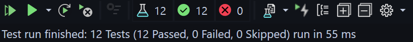
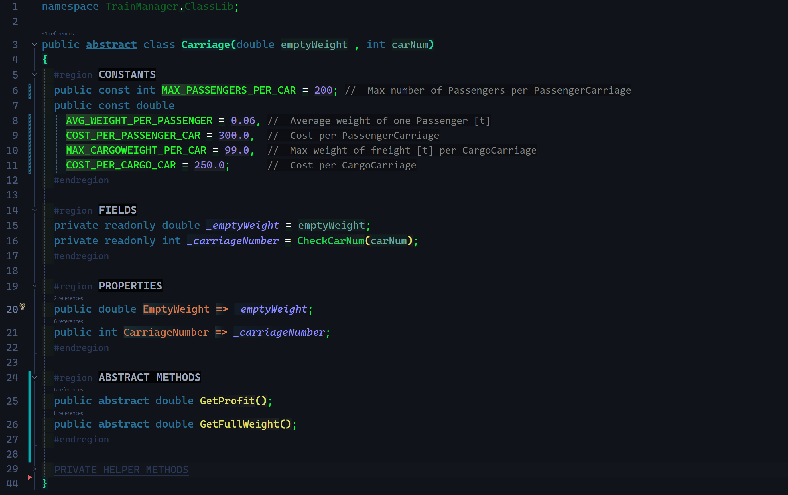
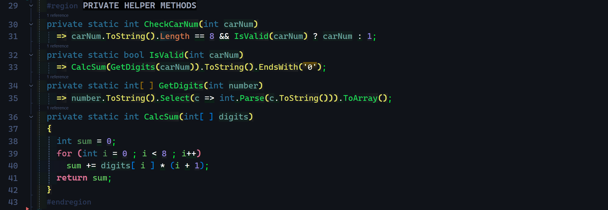
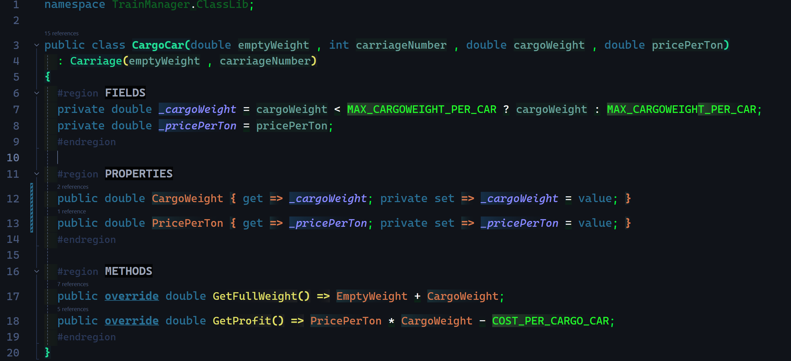
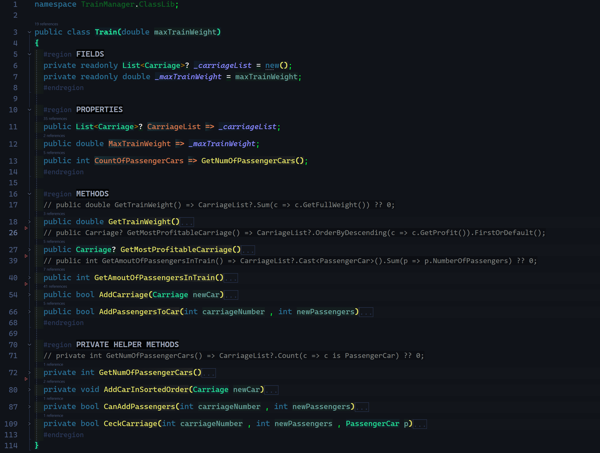
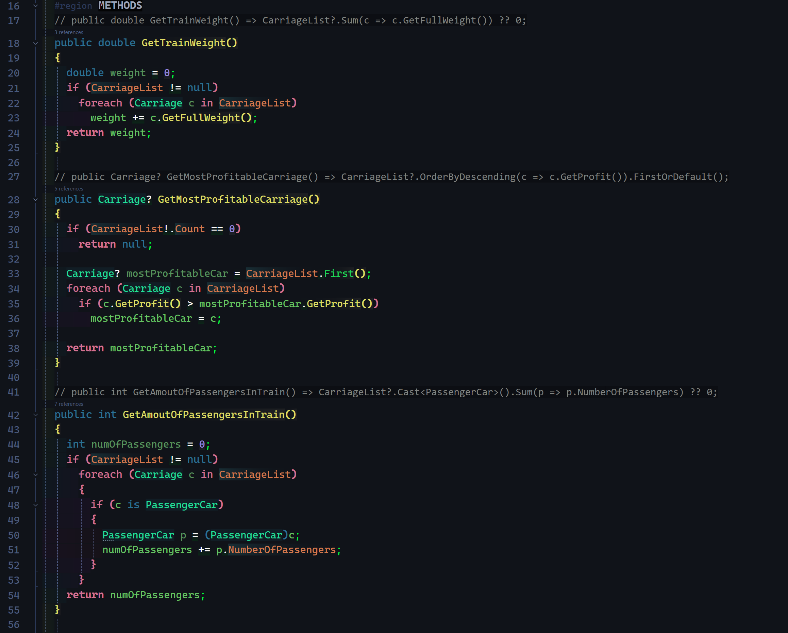
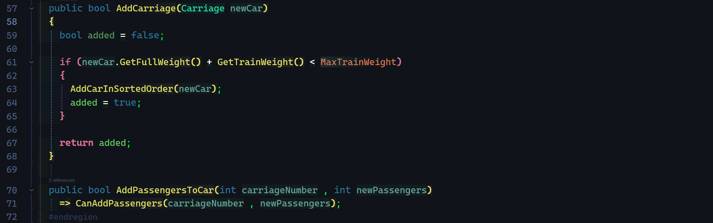
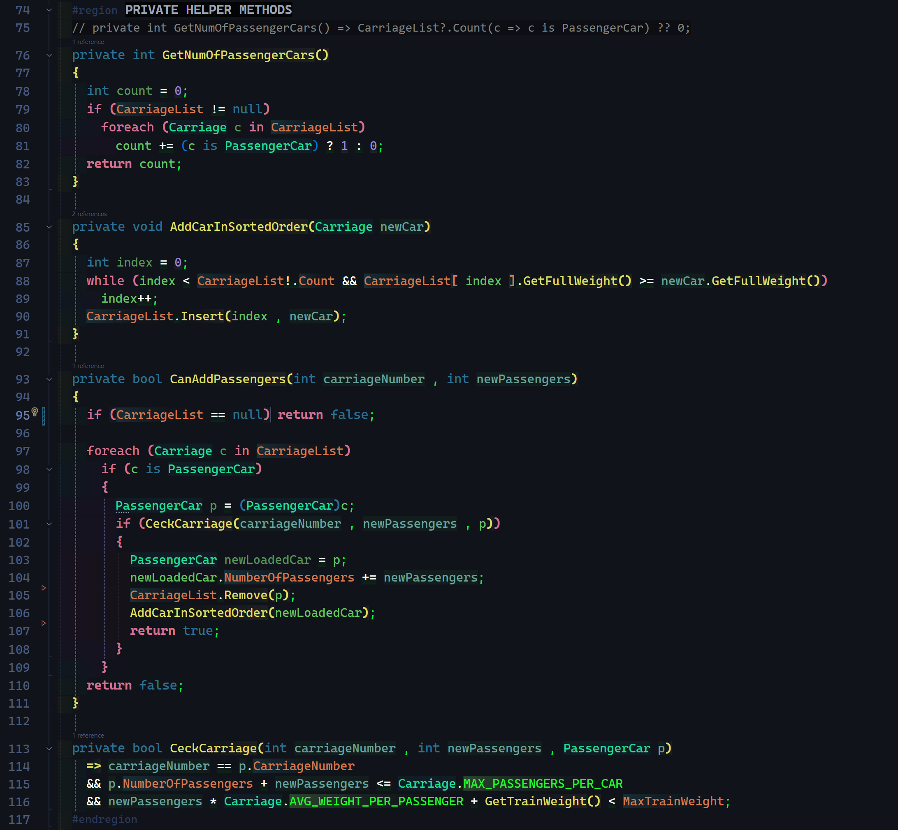

# PoseUebung-007 -- Tain Manager

### Carriage:
> - overview  
    
> - private helper methods  
    

### CargoCar:

### PassengerCar:

### Train:
> - overview    
  
> - public (business) methods  
  
  
> - private (helper) methods  
  